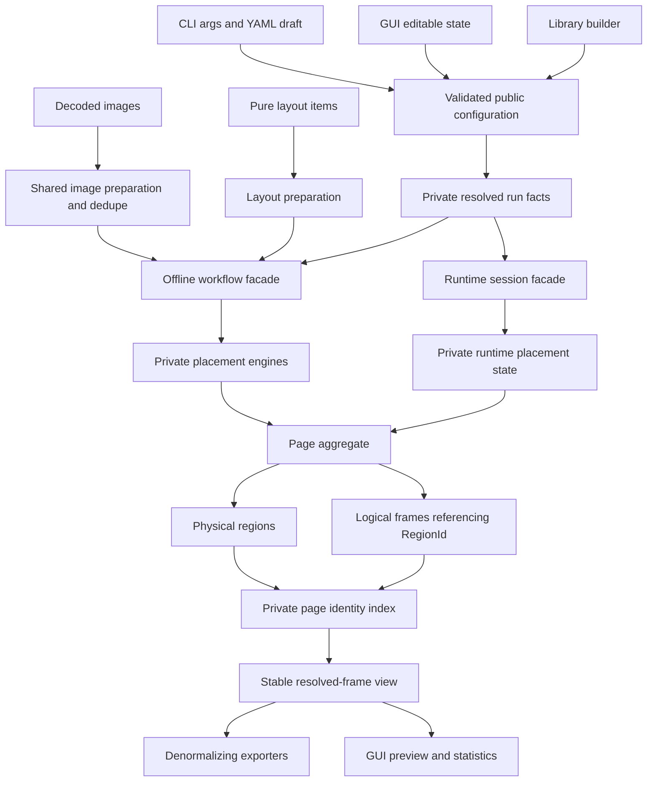

# v0.3 Core Architecture - Plan

## Goal Capsule

| Field | Contract |
|---|---|
| Objective | Establish a v0.3 core architecture in which physical atlas allocation, logical sprite identity, validated configuration, and public workflows have one authoritative representation each. |
| Authority | The user-approved breaking-change scope overrides v0.2 source compatibility; this plan's KTDs override incidental current implementation patterns; repository safety and test conventions remain binding. |
| Execution profile | Multi-unit Rust refactor on `refactor/v0.3-core-architecture`, implemented test-first where invariants change, with targeted cross-version dependency migrations isolated from behavioral refactors. |
| Stop conditions | Stop only for evidence that changes product scope, invalidates a session-settled decision, or makes an external-format compatibility requirement impossible. Source incompatibility with v0.2 is expected and is not a blocker. |
| Tail ownership | `ce-work` owns implementation, simplification, review, verification, conventional commits, branch push, and PR creation or update. |

---

## Product Contract

### Summary

tex-packer v0.3 will expose physical packed regions separately from logical frames, make invalid packing configuration unrepresentable after construction, and replace the public algorithm surface with workflow-oriented offline and runtime APIs. The refactor may delete v0.2 code and break Rust callers, while preserving command-line behavior, GUI workflows, and the established JSON, plist, and template export shapes.

### Problem Frame

The current public `Frame` combines logical sprite metadata with a physical rectangle and rotation flag. Identical-image deduplication therefore has to duplicate physical facts across frames, while statistics infer shared regions from equal rectangles. The current `PackerConfig` exposes every field for mutation, carries mutually irrelevant algorithm settings, and reaches algorithms and runtime constructors without a single enforced normalization boundary. The root crate also re-exports algorithm implementations and helpers that are not stable product concepts. These representations make valid states harder to preserve and force each consumer to reconstruct domain facts independently.

### Actors

- A1. Library consumers packing decoded images or size-only layout data.
- A2. Runtime consumers appending, looking up, evicting, and snapshotting atlas entries.
- A3. CLI and GUI users who expect existing flags, YAML keys, previews, files, and metadata exports to keep their behavior.
- A4. Maintainers changing algorithms, configuration, exporters, and dependency versions without multiplying public compatibility obligations.

### Requirements

**Atlas domain model**

- R1. Each page must own physical `Region` records exactly once, with a page-local typed identity, visible content rectangle, reserved allocation rectangle, and physical rotation state.
- R2. Each logical `Frame` must have a page-local typed `FrameId`, reference one region on its own page, and retain its user key, trimming metadata, source rectangle, and original source size.
- R3. Public construction, lookup, document loading, and snapshot paths must prevent duplicate page or frame identities, dangling region references, duplicate region identities, orphan regions, out-of-page rectangles, overlapping allocations, and content rectangles outside their allocation.
- R4. Deduplicated image inputs must produce multiple logical frames that share one physical region without duplicating physical facts.
- R5. Atlas statistics must report logical frames, physical regions, aliases, rotated regions, trimmed frames, content area, allocation area, content occupancy, and allocation occupancy with definitions shared by offline and runtime results.

**Workflow boundaries**

- R6. Decoded-image packing with and without rendered RGBA pages must share preparation, transparent-image policy, trimming, sorting, deduplication, and placement behavior.
- R7. Pure size/layout inputs must remain a separate workflow with no implied pixel trimming or content deduplication.
- R8. Runtime append, lookup, eviction, statistics, and snapshot operations must use the same public atlas model, return immediately resolvable placement context, reject duplicate keys, and leave all state unchanged on failure while retaining runtime-specific placement state internally.
- R9. Rendered output must reference atlas pages by identity and must not duplicate the complete logical `Page` record beside `Atlas.pages`.

**Configuration and public API**

- R10. Shared page geometry plus workflow-specific offline and runtime configuration must be immutable and valid after construction; adapters may hold editable drafts, but core code must consume only the validated projection for its workflow.
- R11. Algorithm-specific options must be represented by the selected strategy rather than coexisting as unrelated mutable fields, and derived geometry must be computed once before placement.
- R12. The public crate surface must expose workflow concepts and exporters, while placement engines, compositing helpers, geometry helpers, and algorithm implementation types remain crate-private.
- R13. The public v0.2 `Packer` trait, concrete packer constructors, glob-style root re-exports, redundant free-function wrappers, and unstable prelude exports must be removed rather than retained as compatibility shims.

**Compatibility, dependencies, and release**

- R14. JSON array/hash, plist, and template exporters must preserve their v0.2 external field shapes and flatten each logical frame through its referenced region.
- R15. Existing CLI flags, documented YAML keys/scalar forms, output naming, layout-only intent, and GUI workflows on the currently verified Windows development target must remain behaviorally compatible; undocumented YAML tags, merge keys, duplicate keys, and unknown fields become explicit errors.
- R16. The archived `serde_yaml` dependency must be replaced, and approved cross-version dependency upgrades must be migrated in isolated steps with compilation and behavior gates for each affected surface.
- R17. All workspace crates, examples, benchmarks, schemas, and user documentation must describe and compile against the v0.3 API; no abandoned compatibility layer or dead experimental path may remain.
- R18. Native atlas persistence must use an explicit version-2 document DTO whose load path validates the complete atlas aggregate; invariant-bearing domain types must not derive serde traits directly.

### Key Flows

- F1. Rendered offline pack
  - **Trigger:** A1 supplies decoded images and a validated configuration.
  - **Steps:** The offline facade prepares and deduplicates content, places physical regions, creates logical frames, renders each region once, and returns one atlas plus page-image payloads keyed by page identity.
  - **Outcome:** Atlas references are valid, images correspond one-to-one with atlas pages, and aliases share physical storage.
  - **Covered by:** R1-R6, R9-R12.
- F2. Metadata-only decoded-image pack
  - **Trigger:** A1 or the CLI requests layout metadata from decoded images without PNG composition.
  - **Steps:** The same preparation, transparent policy, deduplication, and placement path runs, while rendering is omitted.
  - **Outcome:** Metadata matches F1 exactly for the same inputs and configuration.
  - **Covered by:** R4, R6, R15.
- F3. Pure layout pack
  - **Trigger:** A1 supplies explicit dimensions and optional source metadata without pixel content.
  - **Steps:** The facade validates layout items, sorts and places them, and creates one region per item without content hashing.
  - **Outcome:** The API makes the absence of trimming and content deduplication semantics explicit.
  - **Covered by:** R7, R10-R13.
- F4. Runtime atlas lifecycle
  - **Trigger:** A2 creates a session, appends entries, performs lookups or evictions, and requests statistics or a snapshot.
  - **Steps:** Runtime placement stores stable entry identity and physical allocation, mutations preserve reference validity, and snapshots order live records deterministically.
  - **Outcome:** The snapshot conforms to the same `Atlas` invariants as offline output and reports the same occupancy semantics.
  - **Covered by:** R1-R5, R8, R10-R12.
- F5. Export and preview
  - **Trigger:** A3 exports metadata or opens a GUI preview.
  - **Steps:** The consumer resolves every frame through its containing page, then projects region geometry into the existing flat output or screen representation.
  - **Outcome:** Aliases remain individually visible while physical geometry is sourced from one record.
  - **Covered by:** R3, R4, R14, R15.
- F6. Configuration adaptation
  - **Trigger:** A1 builds offline configuration, A2 builds runtime configuration or creates a session, or A3 loads CLI/YAML settings or applies a GUI preset.
  - **Steps:** An adapter maps input into grouped options, construction validates cross-field constraints, and normalization derives geometry and strategy facts once.
  - **Outcome:** Invalid configurations fail at the boundary with actionable errors and never reach a placement engine.
  - **Covered by:** R10, R11, R15, R16.
- F7. Native atlas persistence
  - **Trigger:** A1 stores an atlas for later restoration or loads an existing version-2 atlas document.
  - **Steps:** The domain aggregate converts to a versioned DTO; loading checks schema version and reconstructs pages through the same invariant validator used by producers.
  - **Outcome:** Valid documents round-trip and invalid identities or geometry never enter the native model.
  - **Covered by:** R3, R18.

### Acceptance Examples

- AE1. Given two decoded images with identical prepared pixels and distinct keys, when F1 or F2 runs, then the page contains one region and two frames with the same region identity; both exported entries have equal packed geometry and statistics report one alias.
- AE2. Given texture padding and extrusion, when one image is packed, then the region's content rectangle matches the rendered sprite, its allocation contains the padding and extrusion reservation, and allocation occupancy uses the larger rectangle.
- AE3. Given a fully transparent image and each supported transparent policy, when F1 and F2 run, then their frame inclusion, source metadata, region geometry, and errors are identical; F3 does not invent a transparent policy.
- AE4. Given a configuration whose borders or reserved per-texture overhead leave no usable placement area, when any public workflow is created, then construction fails before an algorithm or runtime page is allocated.
- AE5. Given a runtime sequence with append, eviction, and another append, when snapshots are taken repeatedly without mutation, then page, region, and frame order and identities are stable and every frame resolves.
- AE6. Given an atlas with aliases, when JSON hash/array, plist, templates, and GUI preview consume it, then each logical key appears independently and resolves to the shared region geometry without exposing `RegionId` in legacy export formats.
- AE7. Given a zero-sized offline item or decoded images all removed by `TransparentPolicy::Skip`, when an offline workflow runs, then it returns a key-aware invalid-input or no-packable-input error and produces no atlas or rendered pages.
- AE8. Given a zero-sized or oversized runtime append, duplicate runtime key, or failed image upload, when the mutation fails, then page IDs, frame and region IDs, allocator/free-space state, statistics, and rendered page buffers are unchanged.
- AE9. Given two offline inputs with the same user key, when they are packed, then their `FrameId` values remain distinct and ordered in the native model and array-like exports; JSON hash retains its documented single-value key limitation.

### Success Criteria

- All atlas-producing and version-2 document-loading paths satisfy one model-invariant test suite and no statistics code infers physical identity from equal rectangles.
- Offline rendered and metadata-only decoded-image workflows produce structurally equal atlases for identical inputs and configuration.
- No public placement algorithm type, public `Packer` trait, raw mutable core configuration field, duplicate logical page record, or deprecated YAML dependency remains.
- Existing export schema fixtures and CLI/GUI behavior gates pass after the core API break.
- Workspace formatting, clippy, all-target compilation, nextest, doctests, examples, and benchmark compilation pass on Rust 1.97.1.

### Scope Boundaries

**Included**

- Breaking Rust API and versioned native-document changes required by R1-R18.
- Removal of obsolete interfaces and tests that exist only to support those interfaces.
- Targeted cross-version dependency migrations and lockfile refreshes listed in KTD8.
- A v0.3 migration guide and version updates for every workspace crate.

**Deferred**

- Runtime pixel-content deduplication; runtime keys remain unique and offline decoded-image deduplication remains authoritative.
- A multivalue representation for duplicate logical keys in JSON hash output; native `FrameId` solves model identity while the existing hash-format limitation remains documented.
- New placement algorithms, new metadata formats, and changes to the visual design of the GUI.
- egui/eframe/egui_extras `0.32 -> 0.35`; the lifecycle and panel removals make that an independent GUI architecture migration rather than a dependency-only step.
- rfd `0.15 -> 0.17`; its rewritten Linux portal backend requires a separate cross-platform GUI validation matrix that this Windows-only lane cannot supply.

---

## Planning Contract

### Key Technical Decisions

- KTD1. Treat v0.3 as a fearless breaking release and delete superseded interfaces instead of layering deprecation wrappers. (session-settled: user-directed — chosen over incremental v0.2 compatibility: the user explicitly allowed breaks, deletion, and a first-principles refactor.)
- KTD2. Complete the Region/Frame model, normalized configuration, and public API contraction in one architecture lane. (session-settled: user-approved — chosen over stopping after the deduplicated-region merge: the user approved the proposed follow-on sequence and requested `ce-plan` plus goal-backed `ce-work` completion.)
- KTD3. Make `Page` the aggregate boundary: it owns private region and logical-frame collections, validates their relationship, and exposes page-scoped resolution methods. `Region` owns content geometry, reserved allocation geometry, and rotation because those are physical placement facts; `Frame` owns `FrameId`, user key, and source reconstruction metadata because aliases and duplicate keys remain logically distinct. This adapts the separation used by TexturePacker aliases and Bevy atlas layouts while preserving tex-packer's trimming model.
- KTD4. Use opaque `u32`-backed `PageId`, `RegionId`, and `FrameId` values rather than vector positions. Offline construction assigns them deterministically; runtime identities are monotonic and snapshots sort by ID, so eviction or collection compaction never retargets a handle.
- KTD5. Use one validated shared `PageConfig`, distinct validated `OfflineConfig` and `RuntimeConfig`, and one `PackingStrategy` sum type as the complete cross-module configuration abstraction budget. Each is produced by a fallible builder. CLI YAML and GUI state remain adapter-owned editable drafts, and the CLI flat DTO owns both YAML input and `--print-config` compatibility. Any preparation, geometry, rendering, Auto, or runtime projection with only one consumer stays local to that module; Auto creates concrete placement-policy candidates instead of cloning a complete configuration.
- KTD6. Replace the public algorithm hierarchy with a crate-private placement engine contract that returns one physical placement result per search. This removes the key generic from algorithms and eliminates the current `can_pack` followed by `pack` duplicate search.
- KTD7. Expose a stateful offline facade with distinct decoded-image render, decoded-image layout, and pure layout operations; keep runtime as a separate session facade. Free wrappers and broad root/prelude exports are removed because they add surface without owning policy.
- KTD8. Upgrade dependencies in isolated, serialized migration checkpoints after behavioral architecture gates are green. (session-settled: user-directed — chosen over staying within current major versions: the user explicitly authorized cross-version upgrades.) Replace `serde_yaml 0.9` with the YAML 1.1-compatible `serde_yaml_ng 0.10`; migrate `rand 0.8` to `0.10.2`, `criterion 0.7` to `0.8.2`, and `indicatif 0.17` to `0.18.6`. Defer egui `0.32 -> 0.35` and rfd `0.15 -> 0.17` because both require a separate GUI/platform migration gate.
- KTD9. Preserve legacy exporter schemas by denormalizing at `ExportManifest`: every logical frame resolves its region and emits the existing flat `frame` and `rotated` fields. Export schema version `1` moves under the exporter projection instead of living in native atlas metadata, and exact golden fixtures define compatibility.
- KTD10. Replace ambiguous occupancy with explicit content and allocation metrics. For final page dimensions, `content_area` is the sum of unique region content rectangles, `allocation_area` is the sum of unique region allocation rectangles, and `page_area` is the sum of page width times height. Content and allocation occupancy divide their respective area by `page_area`, count aliases once through their region, and return zero for an empty atlas. Runtime snapshots use the same equations; runtime-only fragmentation remains separate.
- KTD11. Domain `Atlas`, `Page`, `Region`, and `Frame` do not implement serde traits. Public `AtlasDocument` is the reversible persistence boundary, carries model schema version `2`, serializes the native relationship explicitly, and converts to `Atlas` only through aggregate validation. Legacy flat exporters remain a separate schema-version-1 contract.
- KTD12. Build a non-serialized page-local identity index once when constructing a page, expose stable-order `resolved_frames` traversal, and resolve `PageId` explicitly rather than treating any vector position as identity. This keeps exporter, GUI, and alias-heavy lookup linear in output size instead of quadratic.
- KTD13. Allow duplicate user keys in offline workflows but never use the key as native identity. `FrameId` is authoritative for lookup and ordering; array-like exports preserve both entries, while JSON hash keeps its documented overwrite/last-value limitation. Runtime keys remain unique and duplicate append is rejected.
- KTD14. Runtime mutation uses a prepare/commit protocol: validation and a non-visible placement proposal compute all geometry, page growth, identity values, pixel staging, and blit bounds without mutating live state; one infallible commit applies allocator state, IDs, domain records, and pixels together. Failure injection tests cover every pre-commit boundary.
- KTD15. Normalize all workflow keys to owned `String` values and remove the unused public `Atlas<K>`/`Frame<K>` generic axis. Every current producer and first-party consumer already uses strings or converts into them, exporters require string conversion, and `FrameId` now provides typed identity; retaining a generic label type would expand builders, documents, resolvers, and runtime APIs without a second real workflow.

### Public Rust API Contract

The names and ownership below are the v0.3 allowlist. Minor naming corrections are allowed only when they preserve the same ownership and behavior; adding another public module or abstraction requires updating this table before implementation proceeds.

| Surface | Retained public contract |
|---|---|
| Modules | `config`, `model`, `offline`, `runtime`, `export`, and `error`. Root re-exports may include the primary facade types listed here, but no module or root glob is public. |
| Identity | Opaque, copyable, ordered, hashable `PageId`, `RegionId`, and `FrameId` newtypes backed by `u32`; IDs are never collection indexes. |
| Physical model | `Rect` plus immutable `Region { id, content, allocation, rotated }` accessors. Physical geometry appears nowhere on `Frame`. |
| Logical model | Immutable `Frame { id, key: String, region_id, trimmed, source, source_size }` accessors. User keys may repeat offline; `FrameId` is unique within the page. |
| Page aggregate | Read-only page identity/dimensions, stable `regions()` and `frames()` iteration, keyed `region(RegionId)` and `frame(FrameId)` lookup, and stable `resolved_frames()` traversal yielding `ResolvedFrame` views. Construction is fallible and validates all domain invariants. |
| Atlas aggregate | Stable page iteration and `page(PageId)` lookup, aggregate validation, and `stats()` with the KTD10 formulas. |
| Native persistence | `AtlasDocument` with schema version 2, a conversion from an atlas, and a fallible validated conversion into an atlas. Domain aggregate types themselves expose no serde contract. |
| Configuration | Immutable `PageConfig`, `OfflineConfig`, `RuntimeConfig`, and `PackingStrategy`; offline and runtime builders return validated workflow configs. Strategy-specific enums remain public only when callers choose them through `PackingStrategy` or `RuntimeStrategy`. |
| Offline facade | `OfflinePacker` owns `OfflineConfig` and exposes decoded-image render, decoded-image layout, and pure-layout operations. `InputImage` and `LayoutItem` own string keys and are the only input records. |
| Rendered result | `PackOutput` owns one `Atlas` plus `RenderedPage { page_id, rgba }` payloads; page dimensions and logical metadata are resolved from the atlas, not duplicated in the payload. |
| Runtime facade | `AtlasSession` provides layout-only append/lookup/evict/snapshot/stats; `RuntimeAtlas` adds pixel upload/update behavior. Append returns `RuntimePlacement` containing page, frame, and region identities plus resolved geometry. Image append returns `RuntimeImageUpdate { placement, dirty_region }`; eviction may return an `UpdateRegion` dirty rectangle. Runtime keys are unique. |
| Export facade | JSON array/hash, plist, and template operations plus their documented template DTOs; all flatten through `ExportManifest` and never expose native IDs in legacy formats. |
| Errors | One public error/result family covers invalid config, invalid item dimensions, no packable inputs, duplicate keys, out of space, invalid documents, and invariant violations with key/page context where applicable. |
| Removed | `Packer<K>`, `SkylinePacker`, `MaxRectsPacker`, `GuillotinePacker`, `pack_images`, `pack_layout`, `pack_layout_items`, `prelude::*`, public `packer`/`compositing`/`geometry` modules, and public `compute_trim_rect`. |

The call shape is fixed without prescribing implementation syntax: `OfflineConfig::builder` and `RuntimeConfig::builder` consume their builders on fallible `build`; `OfflinePacker::new` and both runtime `new` constructors accept already validated config; `pack_images`, `layout_images`, and `pack_layout` take owned batches through an immutable offline facade and return owned results; runtime `append`, `append_with_image`, and eviction mutate the session and return owned placement/update values; `Page::try_new` and `Atlas::try_new` are the only public aggregate constructors; `AtlasDocument::from_atlas` and `try_into_atlas` are the persistence conversion pair. Page/atlas lookup borrows and never clones geometry.

An integration test compiled as an external crate must exercise the three offline operations, runtime append/snapshot, native document round-trip, and legacy export using only this allowlist. Its import and call sequence is the adoption gate for the facade.

### High-Level Technical Design

The diagram is a boundary map, not a prescribed type or function layout.

### Domain Invariants

- Region identities are unique within a page and are never interpreted across pages without a page identity.
- Every frame reference resolves to exactly one region in the same page.
- Every region is referenced by at least one logical frame.
- A region's content rectangle is non-empty, lies inside its allocation rectangle, and both lie inside the page bounds.
- Allocation rectangles on a page do not overlap; logical frames may share a region identity.
- Rotation is recorded once per region. A frame's source rectangle remains in unrotated source coordinates.
- Rendered page payloads reference an existing atlas page and match its final dimensions.
- Configuration validation completes before preparation, allocation, Auto candidate evaluation, or runtime page creation.
- Any failed runtime mutation leaves page allocation, identity counters, logical records, pixel buffers, and statistics byte-for-state unchanged.

### Workflow Behavior Matrix

| Workflow | Pixel input | Trimming and transparent policy | Content deduplication | Result |
|---|---|---|---|---|
| Decoded-image render | Required | Shared image preparation | Identical prepared pixels share a region | Atlas plus page-identified RGBA payloads |
| Decoded-image layout | Required | Identical to rendered image preparation | Identical prepared pixels share a region | Atlas only |
| Pure layout | None | Caller-supplied source metadata only | Never; equal sizes remain distinct regions | Atlas only |
| Runtime | Dimensions, with optional upload payload | Not supported; rejected by runtime configuration | Never; keys are unique | Live session plus deterministic atlas snapshot |

### Implementation Sequence

| Stage | Units | Exit signal |
|---|---|---|
| Characterization | U9 | Existing export, YAML, geometry, CLI, and runtime edge behavior is captured before production changes. |
| Validated inputs | U2 | Core, CLI, GUI, examples, and benchmarks cannot construct invalid or workflow-inapplicable core config. |
| Placement boundary | U3 | Algorithms return complete physical placement, perform one search, and are no longer public. |
| Domain foundation | U1 | Offline atlas construction and model tests use explicit indexed regions; inferred physical identity is gone. |
| Offline workflows | U4 | Rendered image, decoded-image layout, and pure layout paths are distinct and share the right preparation layers. |
| Runtime lifecycle | U5 | Runtime mutations and deterministic snapshots satisfy the same page invariants and statistics definitions. |
| Consumer migration | U6 | Export, CLI, and GUI consumers resolve regions and legacy output fixtures remain unchanged. |
| Dependency closure | U7, U10, U13, U11 | YAML, rand, Criterion, and indicatif migrate serially with one green checkpoint and rollback boundary per family. |
| Release closure | U8 | v0.3 docs, quality gates, branch push, and PR are complete. |

### System-Wide Impact

- **Public Rust API:** Struct literals for `PackerConfig`, direct `Frame.frame`/`Frame.rotated` reads, public algorithm constructors, `Packer`, free packing wrappers, and broad prelude imports stop compiling. The migration guide must map each old usage to the v0.3 facade or resolver.
- **Serialized native model:** `Atlas` no longer implements serde directly. `AtlasDocument` version 2 is the supported reversible native persistence format and validates on load; legacy exporters remain the flat interoperability boundary.
- **CLI configuration:** Flat YAML keys and command flags remain stable, but they translate through an adapter DTO into the validated core configuration. YAML parser behavior needs fixture coverage before replacement.
- **GUI state:** Editable controls cannot mutate core configuration fields directly. GUI state owns a draft and validates when starting a pack; validation errors remain user-visible.
- **Runtime state:** Eviction and snapshot ordering can no longer depend on `HashMap` iteration. Region identities and free-space reuse must not invalidate existing handles; duplicate keys and failed appends must be rejected before any ID, geometry, or pixel-page mutation.
- **Performance:** Physical data is stored once for aliases, duplicate placement searches are removed, and page records are no longer cloned into rendered output. Resolver lookups must avoid accidental quadratic exporter/preview behavior.
- **Error propagation:** Builder and adapter errors become the single configuration failure path. CLI context, GUI messages, and library error variants must preserve enough detail to identify the invalid field relationship.

### Risks and Mitigations

| Risk | Impact | Mitigation |
|---|---|---|
| Model migration silently changes rotation or trim geometry | Corrupt exports or rendering | Characterize current outputs first; assert content/allocation/source coordinates for rotated, trimmed, padded, extruded, and aliased inputs. |
| Region references become invalid after runtime eviction | Wrong lookups or panics | Use stable non-positional identities, central page validation, and append/evict/snapshot property sequences. |
| Export compatibility is lost despite a correct native model | Downstream consumers break | Keep `ExportManifest` as the only denormalization boundary and compare existing JSON/plist/template fixtures byte-for-structure. |
| Immutable config makes CLI/GUI migration cumbersome | Adapter duplication or behavior drift | Keep editable DTOs at adapter boundaries and centralize translation tests against one validated builder contract. |
| Cross-version upgrades obscure architectural regressions | Slow diagnosis and rollback | Land dependency families only after architecture gates are green; verify and commit each migration family independently. |
| GUI dependency upgrades exceed available platform evidence | Windows passes while Linux portal or egui lifecycle breaks | Keep egui and rfd pinned in this lane; require a separate cross-platform GUI migration plan before either version family changes. |
| egui 0.35 migration obscures core regressions | Large GUI lifecycle diff and weak attribution | Keep egui 0.32 in this lane and open a separate two-step 0.34 then 0.35 GUI migration after v0.3 core stabilizes. |
| Resolver calls add repeated linear searches | Export/preview slowdown on large atlases | Store or build a page-local lookup with deterministic iteration and add a large-alias regression test or benchmark. |

### Sources and Research

- `docs/workstreams/offline-pipeline-placement-geometry-v1/HANDOFF.md` established shared preparation and placement as the internal direction while deliberately preserving the old public API.
- `docs/workstreams/architecture-deepening-v1/HANDOFF.md` identifies future public API/schema change as a separate follow-on lane and documents the current strict CLI adapter.
- `docs/workstreams/remaining-architecture-deepening-v1/HANDOFF.md` established `ExportManifest`, split runtime strategies, and the CLI module boundaries reused here.
- `crates/tex-packer-core/src/pipeline.rs` already contains private `PackedRegion` and item-index alias grouping, but drops the reserved slot and reconstructs duplicated public frames.
- `crates/tex-packer-core/src/model.rs` currently uses equal `Rect` values to infer physical regions and therefore cannot validate alias identity.
- [TexturePacker custom exporters](https://www.codeandweb.com/texturepacker/documentation/custom-exporter) and [Bevy `TextureAtlasLayout`](https://docs.rs/bevy/latest/bevy/image/struct.TextureAtlasLayout.html) provide prior art for separating physical atlas rectangles from logical sprite identity.
- [Rust API Guidelines: type safety](https://rust-lang.github.io/api-guidelines/type-safety.html) supports validated construction and private representation for invariant-bearing types.
- [Archived `serde_yaml`](https://github.com/dtolnay/serde-yaml), [`serde_yaml_ng` merge semantics](https://docs.rs/serde_yaml_ng/0.10.0/serde_yaml_ng/enum.Value.html#method.apply_merge), [Rand 0.9 and 0.10 migrations](https://rust-random.github.io/book/update-0.10.html), [Criterion changelog](https://docs.rs/crate/criterion/latest/source/CHANGELOG.md), [indicatif releases](https://github.com/console-rs/indicatif/releases), [egui 0.35 release](https://github.com/emilk/egui/releases/tag/0.35.0), and [rfd 0.17 release](https://github.com/PolyMeilex/rfd/releases/tag/0.17.0) define the supported migrations and separate GUI deferrals.

---

## Implementation Units

| Unit | Title | Primary files | Depends on |
|---|---|---|---|
| U9 | Lock v0.2 behavior | Core/CLI fixtures and runtime edge tests | None |
| U2 | Validate workflow configuration | `config/`, adapters, GUI state | U9 |
| U3 | Privatize physical placement | `packer/`, `geometry.rs` | U2, U9 |
| U1 | Introduce the atlas domain model | `model.rs`, `pipeline.rs` | U3, U9 |
| U4 | Establish offline workflows | `offline/`, preparation, output | U1-U3 |
| U5 | Make runtime mutation atomic | `runtime*.rs`, runtime placement | U1-U3 |
| U6 | Migrate consumers and public API | exporters, CLI, GUI, `lib.rs` | U4, U5 |
| U7 | Replace YAML parser | CLI manifest and config adapter | U6 |
| U10 | Upgrade rand | core/CLI random callers | U7 |
| U13 | Upgrade Criterion | core benchmarks | U10 |
| U11 | Upgrade indicatif | CLI input loading | U13 |
| U8 | Publish v0.3 | docs, versions, release artifacts | U1-U7, U9-U11, U13 |

### U9. Lock v0.2 behavior before structural changes

- **Goal:** Turn current externally visible and geometry-sensitive behavior into characterization fixtures before replacing its representation.
- **Requirements:** R14-R18; F1-F7; AE1-AE9.
- **Dependencies:** None.
- **Files:** Strengthen `crates/tex-packer-core/tests/export_smoke.rs`, `deduplicated_regions.rs`, `pack_stats.rs`, `layout_vs_images.rs`, `transparent_policy.rs`, `boundary_conditions.rs`, and runtime integration tests. Add CLI adapter/output tests beside `crates/tex-packer-cli/src/config_adapter.rs` and `output_writer.rs`; add golden fixtures under the owning test directories for JSON, plist, templates, and YAML.
- **Approach:** Capture behavior that must survive representation changes: rotated/trimmed/padded/extruded geometry, alias ordering, legacy export fields and page names, flat YAML overlay/printing, CLI layout-only output suppression, and runtime state after failed mutation. Existing-behavior fixtures remain green. Each newly exposed defect regression is checked in as ignored with a precise reason and owning U-ID, then unignored only when that unit makes it pass; no unrelated unit inherits an ambiguous red baseline.
- **Test scenarios:** Golden outputs cover aliases, rotation, trimming, multi-page naming, and every built-in template; YAML fixtures cover all supported keys and invalid syntax; geometry fixtures pin visible and reserved coordinates; runtime fixtures prove failure atomicity and duplicate-key rejection; all-Skip and zero-size cases have explicit expected errors.
- **Verification:** Existing behavior fixtures pass; each ignored expected-red test demonstrably fails when run alone, names its resolving unit, and remains excluded from broad green gates only until that unit lands; no production code changes are included.

### U2. Replace mutable raw configuration with workflow projections

- **Goal:** Make invalid shared geometry and workflow-specific configuration unrepresentable and give each subsystem only the normalized facts it owns.
- **Requirements:** R10, R11, R15; F6; AE4, AE7, AE8.
- **Dependencies:** U9.
- **Files:** Replace `crates/tex-packer-core/src/config.rs` with a deep `crates/tex-packer-core/src/config/` module as warranted; modify `geometry.rs`, `preparation.rs`, `pipeline.rs`, `packing_plan.rs`, `runtime.rs`, `runtime_atlas.rs`, `runtime_placement.rs`, and `packer/`. Modify CLI `config_adapter.rs`, `pack_command.rs`, and `examples/bench_portfolio.rs`; modify GUI `state.rs`, `presets.rs`, and `ui/setup_panel.rs`. Add focused core and adapter tests beside the owners.
- **Approach:** Limit cross-module config types to `PageConfig`, `OfflineConfig`, `RuntimeConfig`, and `PackingStrategy`. Group offline options by preprocessing and selected strategy, keep the flat CLI/YAML DTO as the compatibility owner, and keep one-consumer resolved views local to their module. Resolve checked dimensions, allocation overhead, usable bounds, page sizing, concrete Auto candidates, and supported metadata once without creating another general-purpose config layer.
- **Test scenarios:** Defaults remain equivalent; every CLI/YAML key maps correctly; irrelevant strategies cannot coexist; unsupported runtime/offline options cannot be accepted by the wrong builder; zero dimensions, border exhaustion, overflow, and impossible reservation fail at build time; GUI presets validate; valid configs preserve placements for each family.
- **Verification:** Core config and CLI adapter tests pass; examples and GUI compile without direct core-field mutation; raw public configuration is not stored by engines or runtime pages.

### U3. Make placement algorithms a private physical-placement engine

- **Goal:** Return authoritative physical geometry from one search and remove algorithm implementation details from the public contract.
- **Requirements:** R1, R11-R13; F1-F4.
- **Dependencies:** U2, U9.
- **Files:** Modify `crates/tex-packer-core/src/packer/{mod,skyline,maxrects,guillotine}.rs`, `free_space.rs`, `geometry.rs`, and `pipeline.rs`. Move low-level assertions from `tests/maxrects_*.rs`, `skyline_*.rs`, `guillotine_rotation_fit.rs`, `maxrects_disjoint_small.rs`, and `padding_extrude_offsets.rs` into crate-private unit tests; migrate `examples/bench_mr_reference.rs` to the public facade later or delete it if it has no public value.
- **Approach:** Replace key-aware `Packer<K>`, `can_pack`, and `pack` with one crate-private placement attempt that accepts normalized content dimensions and returns visible content, reserved allocation, and rotation. Keep heuristics inside the selected policy. Preserve algorithm regression coverage before deleting public constructors and module exposure.
- **Test scenarios:** Existing heuristic, determinism, rotation-fit, waste-map, and disjointness cases remain covered; unsuccessful attempts do not mutate state; successful attempts mutate once; Auto builds concrete policies; no key or source metadata reaches an algorithm.
- **Verification:** Private algorithm tests and public cross-family invariants pass; production callers receive authoritative allocation geometry; rustdoc contains no public `Packer` or concrete packer type.

### U1. Introduce the explicit indexed atlas domain model

- **Goal:** Make pages, regions, frames, and statistics encode the physical/logical split directly, then migrate offline atlas construction to it.
- **Requirements:** R1-R5, R14, R18; F1, F2, F5, F7; AE1, AE2, AE6, AE9.
- **Dependencies:** U3, U9.
- **Files:** Modify `crates/tex-packer-core/src/model.rs`, `pipeline.rs`, `geometry.rs`, `export_manifest.rs`, `error.rs`, `runtime.rs`, `runtime_atlas.rs`, and `runtime_placement.rs`. Modify `tests/deduplicated_regions.rs`, `pack_stats.rs`, `algorithm_invariants.rs`, `boundary_conditions.rs`, `pow2_square.rs`, and runtime compile-path tests; add `tests/model_invariants.rs`, `tests/native_document.rs`, and `benches/atlas_resolution.rs`.
- **Approach:** Add typed `PageId`, `RegionId`, and `FrameId`, explicit content/allocation geometry, private aggregate collections, and non-serialized identity indexes. Provide stable resolved-frame traversal and versioned `AtlasDocument` conversion. Populate offline regions from U3 placement results, preserve logical input order, move legacy schema metadata out of native `Meta`, and calculate KTD10 metrics. Adapt runtime storage minimally to the new aggregate so core remains green; U5 owns transactional behavior and deterministic lifecycle semantics.
- **Test scenarios:** Identical pixels share one region; duplicate keys receive distinct frame IDs; document round-trip preserves the aggregate and invalid documents fail; hash-collision fallback stays distinct; rotation and allocation geometry are authoritative; every listed ID/geometry invariant is enforced; 1k versus 10k alias resolution/export scaling remains below 20x median time; page sizing contains both rectangles; statistics match numeric KTD10 fixtures.
- **Verification:** Model, native document, dedupe, statistics, boundary, exporter, runtime compile-path, and algorithm invariant suites pass; the alias scaling benchmark shows no quadratic growth; no `HashSet<Rect>` identity inference or domain serde derive remains.

### U4. Establish offline workflow boundaries and one output truth

- **Goal:** Give decoded-image rendering, decoded-image layout, and pure layout explicit operations while eliminating duplicated page records.
- **Requirements:** R4, R6, R7, R9, R12, R13; F1-F3; AE1, AE3, AE7.
- **Dependencies:** U1, U2, U3.
- **Files:** Refactor `crates/tex-packer-core/src/pipeline.rs` into a workflow-oriented `offline/` module as warranted; modify `preparation.rs`, `packing_plan.rs`, `compositing.rs`, and `lib.rs`. Modify `tests/layout_vs_images.rs`, `transparent_policy.rs`, `compose_extrude_no_bleed.rs`, `force_max_and_border.rs`, and `deduplicated_regions.rs`.
- **Approach:** Introduce one public offline facade owning validated offline config. Route both decoded-image operations through shared preparation, dedupe, and placement, with rendering as a terminal adapter. Keep pure layout preparation separate and replace `OutputPage.page` with explicit `PageId` plus pixels. Keep existing wrappers only as the already-present bridge until U6 migrates all first-party consumers; do not add new compatibility layers.
- **Test scenarios:** Rendered and metadata-only atlases are equal; Skip and OneByOne match across decoded-image paths; all-Skip and zero-sized input errors are explicit and key-aware; pure layout never deduplicates equal sizes; rendered page IDs resolve and match dimensions; duplicate offline keys still render by item identity; empty and out-of-space errors remain specific.
- **Verification:** Offline parity, transparent, compositing, border, and dedupe suites pass; no complete `Page` clone exists outside `Atlas.pages`; both new facade and existing first-party callers compile pending U6 cutover.

### U5. Make runtime mutation atomic and snapshots deterministic

- **Goal:** Preserve atlas invariants, stable identities, pixel/geometry consistency, and statistics across every runtime mutation and failure.
- **Requirements:** R1-R5, R8, R10-R12; F4; AE2, AE4, AE5, AE8.
- **Dependencies:** U1, U2, U3.
- **Files:** Modify `crates/tex-packer-core/src/runtime.rs`, `runtime_atlas.rs`, `runtime_placement.rs`, and `runtime_placement/{guillotine,shelf,skyline}.rs`. Modify `tests/runtime_session.rs`, `runtime_api_improvements.rs`, `runtime_atlas_tests.rs`, `runtime_shelf.rs`, and `runtime_skyline.rs`.
- **Approach:** Store physical regions and logical frames separately under `PageId`, `RegionId`, and `FrameId`; use the unique-key index for lookup and add no third entry identity. Return immediately resolved placement context. Runtime strategies create an immutable placement proposal against staged allocator/page state; validation, page growth, identity reservation, pixel allocation, and blit bounds complete before one infallible commit swaps in allocator state, counters, domain records, and pixels. Reject duplicate keys and sort snapshots by stable IDs.
- **Test scenarios:** Append results equal snapshot resolution; eviction frees the exact allocation; later insertion cannot retarget identity; duplicate, zero-size, oversized, and failed image appends leave snapshots, free space, stats, pixels, and next IDs unchanged; the next valid first append still uses page 0; repeated snapshots are equal; every runtime strategy preserves padding/extrusion/rotation.
- **Verification:** All runtime suites and mutation-sequence/property tests pass; no runtime page stores a detached public frame as placement state; failure atomicity is asserted across geometry and pixels.

### U6. Migrate exporters, CLI, GUI, and the curated public surface

- **Goal:** Move first-party consumers to resolved frames, preserve user-facing formats/workflows, and expose only the v0.3 facade.
- **Requirements:** R12-R15, R18; F2, F5, F6; AE3, AE6, AE9.
- **Dependencies:** U4, U5.
- **Files:** Modify core `export_manifest.rs`, `export.rs`, `export_plist.rs`, and `lib.rs`; CLI `pack_command.rs`, `output_writer.rs`, `main.rs`, and examples; GUI `main.rs`, `state.rs`, `stats.rs`, and `ui/preview_panel.rs`. Modify `tests/export_smoke.rs`, fixtures under `schemas/` and CLI/template test data; add CLI layout-only parity tests and `crates/tex-packer-core/tests/public_api.rs`.
- **Approach:** Keep `ExportManifest` as the only flat-format projection and consume stable resolved frames. Route CLI `--layout-only` through decoded-image metadata packing and resolve GUI page images by `PageId`. Enforce the Public Rust API Contract as a finite allowlist, migrate every first-party caller, then remove old wrappers, helper-module exposure, glob re-exports, and the prelude in the same green checkpoint.
- **Test scenarios:** Exact JSON array/hash, plist, and all template goldens preserve fields, order, page names, aliases, rotation, trim, and multi-page data; CLI layout-only applies transparent policy/dedupe without PNGs; normal CLI writes one PNG per page; GUI resolves aliases/page images; downstream compile fixtures use only curated imports.
- **Verification:** Export/schema and CLI parity tests pass; the external-style public API fixture covers all promised workflows using only allowlisted imports; CLI and GUI all-target checks pass; public-item inspection matches the finite allowlist and removed-symbol list.

### U7. Replace archived serde_yaml with serde_yaml_ng

- **Goal:** Preserve the flat YAML configuration contract on a maintained YAML 1.1-compatible parser.
- **Requirements:** R15-R17; F6.
- **Dependencies:** U6.
- **Files:** Modify `crates/tex-packer-cli/Cargo.toml`, `Cargo.lock`, `crates/tex-packer-cli/src/config_adapter.rs`, `pack_command.rs`, and YAML fixtures/tests.
- **Approach:** Replace parser calls behind the CLI DTO, keep merge expansion disabled, deny unknown fields, and reject tags/merge keys deliberately. Limit lockfile churn to necessary parser-family transitive changes.
- **Test scenarios:** Every supported key, enum spelling, optional field, YAML 1.1 boolean, round-trip, and error location is preserved; duplicate keys, unknown fields, tags, and merge keys fail clearly.
- **Verification:** CLI adapter/output tests pass and the dependency graph contains no archived `serde_yaml`.

### U10. Upgrade rand

- **Goal:** Move random test and example generation to rand 0.10.2 without changing product behavior.
- **Requirements:** R16, R17.
- **Dependencies:** U7.
- **Files:** Modify core/CLI manifests, `Cargo.lock`, random-using tests, and `crates/tex-packer-cli/examples/`.
- **Approach:** Apply the official 0.9 and 0.10 migrations, use explicit seeded generators where reproducibility matters, and avoid treating prior `StdRng` byte streams as a product contract.
- **Test scenarios:** Randomized tests remain deterministic by invariant; every random-data example compiles and produces valid dimensions; no production randomness is introduced.
- **Verification:** Affected tests and examples pass with rand 0.10.2 before any Criterion change enters the lockfile.

### U13. Upgrade Criterion

- **Goal:** Move benchmark targets to Criterion 0.8.2 with an isolated benchmark-only checkpoint.
- **Requirements:** R16, R17.
- **Dependencies:** U10.
- **Files:** Modify `crates/tex-packer-core/Cargo.toml`, `Cargo.lock`, `crates/tex-packer-core/benches/runtime_strategies.rs`, and `benches/atlas_resolution.rs` only as required.
- **Approach:** Apply the official Criterion migration after rand is green, retain benchmark groups and throughput metadata, and do not compare results against old memory-layout-sensitive baselines.
- **Test scenarios:** Both runtime strategy and alias-resolution benchmarks compile, enumerate their expected groups, and complete representative low-sample runs.
- **Verification:** Benchmark compilation and smoke gates pass with Criterion 0.8.2 before indicatif changes enter the lockfile.

### U11. Upgrade indicatif

- **Goal:** Adopt indicatif 0.18.6 while preserving CLI progress and redirected-output behavior.
- **Requirements:** R15-R17.
- **Dependencies:** U13.
- **Files:** Modify `crates/tex-packer-cli/Cargo.toml`, `Cargo.lock`, `crates/tex-packer-cli/src/input_loader.rs`, and focused CLI tests.
- **Approach:** Keep progress ownership in input loading, adapt only changed APIs, and avoid exposing console crate types across module boundaries.
- **Test scenarios:** Progress completes for normal and parallel input loading; redirected/non-terminal output does not emit broken control sequences; no-progress behavior is unchanged.
- **Verification:** CLI tests and all-target checks pass with indicatif 0.18.6.

### U8. Publish the v0.3 contract and close the refactor

- **Goal:** Make the breaking API understandable, version every crate consistently, remove obsolete code, and ship a reviewable branch.
- **Requirements:** R13-R18.
- **Dependencies:** U1-U7, U9-U11, U13.
- **Files:** Modify `README.md`, `crates/tex-packer-core/README.md`, `CHANGELOG.md`, all workspace manifests/path versions, examples, and schema documentation. Add `docs/migrations/v0.3.md` and a durable architecture note under `docs/solutions/`.
- **Approach:** Bump all crates to 0.3.0, document the public allowlist, resolver/config model, `AtlasDocument` v2, duplicate-key behavior, and egui/rfd deferrals, and provide an old-to-new API table. Remove dead helpers, obsolete tests, stale comments, and abandoned paths. Run simplification/review, resolve actionable findings, commit focused changes, push, and open or update the PR.
- **Test scenarios:** README examples/doctests compile; migration covers each removed symbol class and native persistence change; a black-box external consumer fixture completes decoded render/layout, pure layout, runtime append/snapshot, document round-trip, and legacy export using only documented imports; path versions agree; quick start works from a clean checkout.
- **Verification:** The full Verification Contract passes; `git diff --check` is clean; the branch contains only intentional files; the PR records KTD-level breaks, dependency checkpoints, and residual platform risk.

---

## Verification Contract

| Gate | Command | Units | Required outcome |
|---|---|---|---|
| Formatting | `cargo fmt --all --check` | U1-U11, U13 | No formatting drift. |
| Core tests | `cargo nextest run -p tex-packer-core --all-features` | U1-U6, U9, U10, U13 | All model, pipeline, algorithm, export, and runtime tests pass. |
| Workspace tests | `cargo nextest run --workspace --all-features` | U6-U11, U13, final | All first-party crates and integration tests pass after consumer cutover and every dependency checkpoint. |
| Lints | `cargo clippy --workspace --all-targets --all-features -- -D warnings` | U1-U11, U13 | No warning or lint is accepted as debt. |
| Locked all-target build | `cargo check --workspace --all-targets --all-features --locked` | U6-U11, U13, final | Libraries, binaries, examples, tests, and benchmarks compile from the committed lockfile. |
| Documentation | `cargo test --workspace --doc --all-features` | U6-U8 | Public examples and doctests compile and pass. |
| Benchmark compile | `cargo bench -p tex-packer-core --no-run` | U1, U3, U10, U13 | Runtime and resolver Criterion targets compile. |
| Runtime benchmark smoke | `cargo bench -p tex-packer-core --bench runtime_strategies -- --sample-size 10` | U13 | Runtime strategy groups execute under Criterion 0.8 without baseline comparison. |
| Resolver benchmark smoke | `cargo bench -p tex-packer-core --bench atlas_resolution -- --sample-size 10` | U1, U13 | 10x aliases remain below 20x median traversal/export time. |
| CLI smoke | `cargo run -p tex-packer-cli -- --help` | U6, U7, U11 | CLI starts and exposes the existing command families. |
| GUI build | `cargo check -p tex-packer-gui --all-targets --locked` | U2, U6 | GUI and unchanged dialog stack compile against the selected dependency set. |
| Diff integrity | `git diff --check` | U1-U11, U13 | No whitespace errors or conflict markers. |

The implementation must run each U-ID's focused scenarios before its broader gate. U9's expected-red defect tests remain ignored and mapped to U2-U6 until their owning unit makes them pass and removes the ignore. U2, U3, U1, U4, and U5 use focused core gates while first-party consumers are in transition; the full workspace gate becomes mandatory at U6 and after every serialized dependency unit. The dependency order is U7 -> U10 -> U13 -> U11, and the next unit cannot begin until the current family is green.

---

## Definition of Done

- R1-R18 and AE1-AE9 are traceable to passing tests, documentation, or an explicit verification artifact.
- Every atlas-producing and document-loading workflow validates page, frame, and region identities, geometry containment, non-overlap, and references.
- Offline and runtime statistics use the explicit KTD10 content/allocation equations and no code infers aliases from rectangle equality.
- Core configuration is immutable and valid after construction; raw adapter drafts never cross into packing or runtime internals.
- Placement algorithms are crate-private, key-agnostic, and perform one placement search per attempt.
- Decoded-image render/layout parity and pure-layout separation are demonstrated by tests.
- `FrameId` makes duplicate offline keys unambiguous in the native model, runtime duplicate keys fail atomically, and JSON hash limitations are documented.
- `AtlasDocument` version 2 round-trips valid atlases and rejects every invalid aggregate fixture; domain types expose no accidental serde contract.
- Legacy JSON, plist, template, CLI, and verified Windows GUI behavior gates pass despite the Rust API break.
- The black-box external consumer fixture completes every documented public workflow using only the finite API allowlist.
- serde_yaml_ng, rand, Criterion, and indicatif upgrades are complete and individually verified; egui 0.35 and rfd 0.17 are explicitly deferred to a cross-platform GUI migration.
- Workspace crates report version `0.3.0`; README, changelog, migration guide, examples, and durable architecture notes agree with the final API.
- Formatting, nextest, clippy, locked all-target checks, doctests, benchmark compilation, CLI smoke, and diff integrity all pass on the final tree.
- Simplification and code review have no unresolved P0/P1 or correctness findings.
- Experimental, compatibility-only, superseded, and dead code from abandoned approaches is removed from the final diff.
- The feature branch is committed with focused Conventional Commit messages, pushed, and represented by an up-to-date PR with verification evidence.
